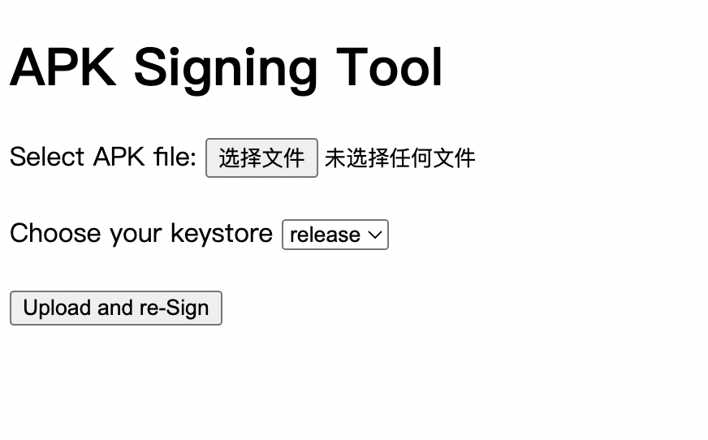

# Resign_apk_web

Upload an APK file and re-sign it using your own keystore.

# Preview

# QuickStart

1. Upload the keystore to the keystores directory.
2. Edit config.json and fill in the certificate information.
3. Execute ./start.sh
4. Open the page on port 8000.
5. You can change the JDK and apksigner versions in start.sh.
